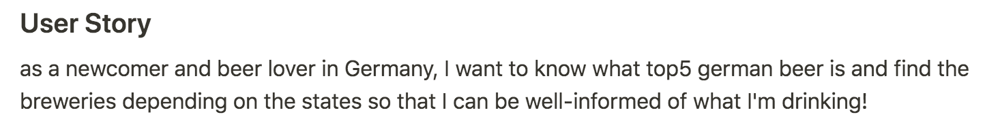
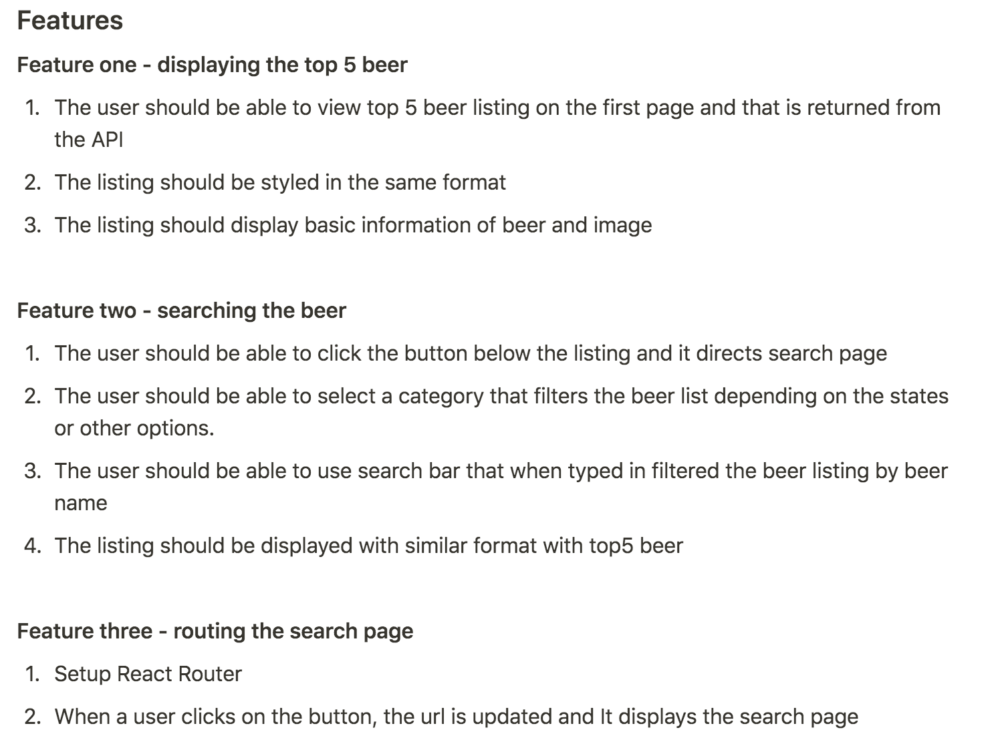
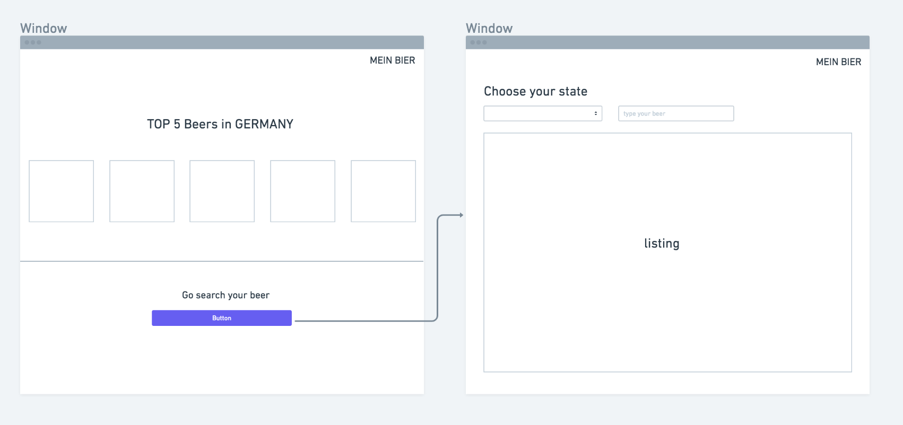
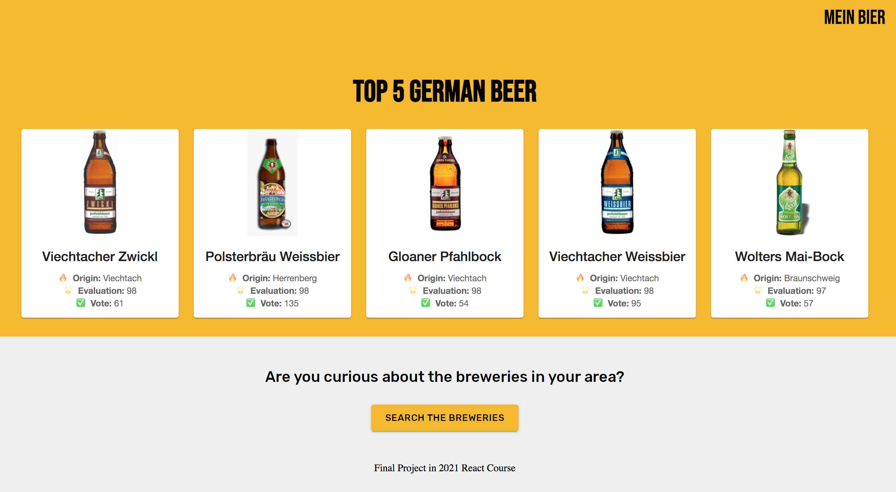
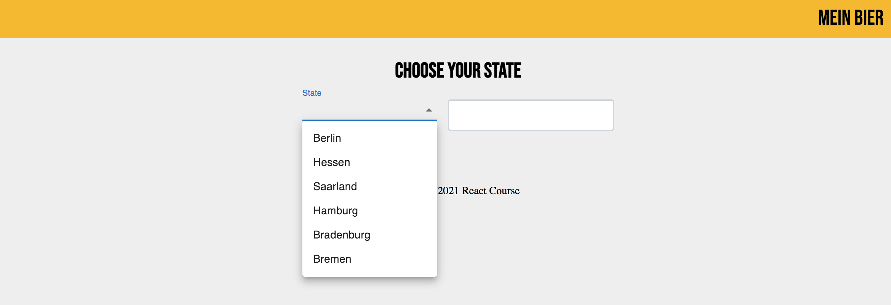
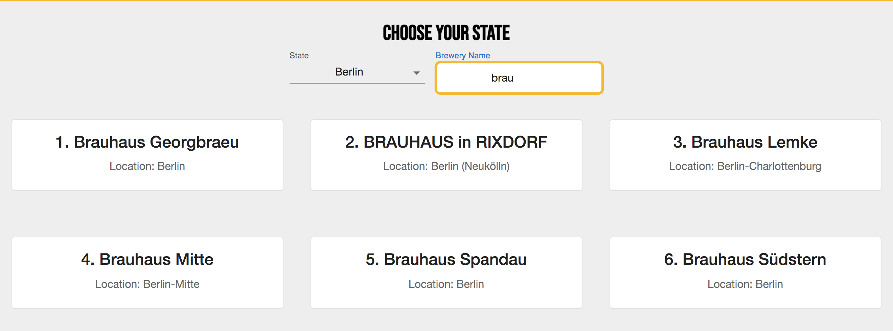

<!-- Heading-->

# Mein Bier 🍻

This is the final project at Redi School's 2021 fall semester React Course. The goal is creating a react app that displays the top 5 german beers and searches for breweries by german federal states. It contains the concepts that we've been learning this semester including hooks, routing, local & global state management, etc.
<br>
<br>

## ✍️ Project Planning

1. **Create user story**
   
2. **Features** <br>
   
3. **Wireframing** <br>
   
<br>
<br>

## 📽 Project Overview




<br>
<br>

## 🔧Technologies

- framework: React.js
- data fetching: RESTful API
- routing: React Router
- styling: Material Ui
<br>
<br>

## 🔥 Further Task for improvement

- refacture Brew/Beer Card Component.
- refacture DisplayCard function to make more reusable.
- add 'heart' or 'star' button on the brewery cards so the user can save their favorite breweries on the list. 
<br>
<br>

## 🤖 Setup

to install dependencies

```
npm install
```

to run the application

```
npm start
```
